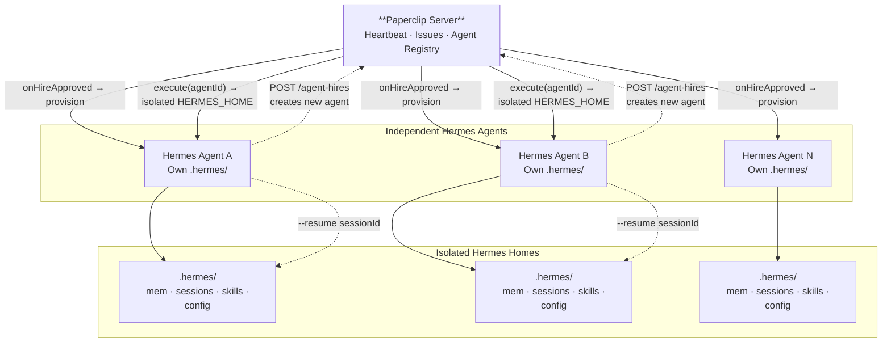

# Paperclip Adapter for Hermes Agent

A [Paperclip](https://paperclip.ing) adapter that provisions and manages **independent, isolated Hermes Agent instances** — each with their own state, memory, sessions, and workspace. The adapter handles the complete agent lifecycle: creation, provisioning, execution, session continuity, and cleanup. Any agent in a Paperclip company can programmatically create new Hermes agents on demand through the standard Paperclip API, and the adapter takes care of the rest.

[Hermes Agent](https://github.com/NousResearch/hermes-agent) by [Nous Research](https://nousresearch.com) is a full-featured AI agent with 30+ native tools, persistent memory, session persistence, 80+ skills, MCP support, and multi-provider model access.

## Key Features

This adapter provides:

- **8 inference providers** — Anthropic, OpenRouter, OpenAI, Nous, OpenAI Codex, ZAI, Kimi Coding, MiniMax
- **Skills integration** — Scans both Paperclip-managed and Hermes-native skills (`~/.hermes/skills/`), with sync/list/resolve APIs
- **Structured transcript parsing** — Raw Hermes stdout is parsed into typed `TranscriptEntry` objects so Paperclip renders proper tool cards with status icons and expand/collapse
- **Rich post-processing** — Converts Hermes ASCII banners, setext headings, and `+--+` table borders into clean GFM markdown
- **Comment-driven wakes** — Agents wake to respond to issue comments, not just task assignments
- **Auto model detection** — Reads `~/.hermes/config.yaml` to pre-populate the UI with the user's configured model
- **Session codec** — Structured validation and migration of session state across heartbeats
- **Benign stderr reclassification** — MCP init messages and structured logs are reclassified so they don't appear as errors in the UI
- **Session source tagging** — Sessions are tagged as `tool` source so they don't clutter the user's interactive history
- **Filesystem checkpoints** — Optional `--checkpoints` for rollback safety
- **Thinking effort control** — Passes `--reasoning-effort` for thinking/reasoning models

### Hermes Agent Capabilities

| Feature | Claude Code | Codex | Hermes Agent |
|---------|------------|-------|-------------|
| Persistent memory | ❌ | ❌ | ✅ Remembers across sessions |
| Native tools | ~5 | ~5 | 30+ (terminal, file, web, browser, vision, git, etc.) |
| Skills system | ❌ | ❌ | ✅ 80+ loadable skills |
| Session search | ❌ | ❌ | ✅ FTS5 search over past conversations |
| Sub-agent delegation | ❌ | ❌ | ✅ Parallel sub-tasks |
| Context compression | ❌ | ❌ | ✅ Auto-compresses long conversations |
| MCP client | ❌ | ❌ | ✅ Connect to any MCP server |
| Multi-provider | Anthropic only | OpenAI only | ✅ 8 providers out of the box |
| Independent lifecycle | ❌ | ❌ | ✅ Isolated homes, auto-provisioning, cleanup |

## Independent Agent Lifecycle

This adapter manages **independent, isolated Hermes agents** whose full lifecycle is owned by the adapter. Each agent runs with its own state — there is no shared state between agents. Every aspect of the lifecycle is handled automatically:

### Isolation & Provisioning

Each agent gets its own isolated Hermes home directory at:

```
/home/paperclip/data/companies/{companyId}/agents/{agentId}/.hermes/
```

This directory contains all agent state:
- **memories/** — persistent memory across sessions
- **sessions/** — conversation history (resumable across heartbeats)
- **skills/** — Hermes-native skills
- **config.yaml** — model and provider settings
- **auth.json** — API credentials
- **SOUL.md** — agent persona

New agents are provisioned automatically on first heartbeat via the `onHireApproved` hook, which creates the isolated home directory and copies the template from `~/.hermes/`.

### Session Continuity

Agents maintain conversation context across Paperclip heartbeats using Hermes's `--resume` flag. Each run picks up where the last one left off — preserving memories, tool state, and pending work. The `sessionCodec` validates and migrates session state between runs.

### Automatic Cleanup

When an agent is removed from Paperclip, its isolated Hermes home and workspace are automatically cleaned up on the next execute run. No orphaned state accumulates.

### Programmatic Agent Creation

**Any Hermes agent (or any other Paperclip agent) can create new Hermes agents on demand** via the standard Paperclip API:

```bash
curl -s -X POST "{{paperclipApiUrl}}/companies/{{companyId}}/agent-hires" \
  -H "Authorization: Bearer $PAPERCLIP_API_KEY" \
  -H "Content-Type: application/json" \
  -d '{
    "name": "My New Agent",
    "adapterType": "hermes_local",
    "adapterConfig": {
      "model": "MiniMax-M2.7-highspeed",
      "timeoutSec": 300,
      "persistSession": true
    },
    "role": "engineer",
    "title": "Software Engineer"
  }'
```

The adapter provisions the new agent's isolated Hermes home immediately, making it ready to receive work on its next heartbeat.

> **Valid roles for new agents:** `ceo`, `cto`, `cmo`, `cfo`, `security`, `engineer`, `designer`, `pm`, `qa`, `devops`, `researcher`, `general`

## Installation

```bash
npm install hermes-paperclip-adapter
```

### Prerequisites

- [Hermes Agent](https://github.com/NousResearch/hermes-agent) installed (`pip install hermes-agent`)
- Python 3.10+
- At least one LLM API key (Anthropic, OpenRouter, or OpenAI)

## Quick Start

### 1. Register the adapter in your Paperclip server

Add to your Paperclip server's adapter registry (`server/src/adapters/registry.ts`):

```typescript
import * as hermesLocal from "hermes-paperclip-adapter";
import {
  execute,
  testEnvironment,
  detectModel,
  listSkills,
  syncSkills,
  sessionCodec,
} from "hermes-paperclip-adapter/server";

registry.set("hermes_local", {
  ...hermesLocal,
  execute,
  testEnvironment,
  detectModel,
  listSkills,
  syncSkills,
  sessionCodec,
});
```

### 2. Create a Hermes agent in Paperclip

In the Paperclip UI or via API, create an agent with adapter type `hermes_local`:

```json
{
  "name": "Hermes Engineer",
  "adapterType": "hermes_local",
  "adapterConfig": {
    "model": "anthropic/claude-sonnet-4",
    "maxIterations": 50,
    "timeoutSec": 300,
    "persistSession": true,
    "enabledToolsets": ["terminal", "file", "web"]
  }
}
```

### 3. Assign work

Create issues in Paperclip and assign them to your Hermes agent. On each heartbeat, Hermes will:

1. Receive the task instructions
2. Use its full tool suite to complete the work
3. Report results back to Paperclip
4. Persist session state for continuity

## Configuration Reference

### Core

| Field | Type | Default | Description |
|-------|------|---------|-------------|
| `model` | string | `anthropic/claude-sonnet-4` | Model in `provider/model` format |
| `provider` | string | *(auto-detected)* | API provider: `auto`, `openrouter`, `nous`, `openai-codex`, `zai`, `kimi-coding`, `minimax`, `minimax-cn` |
| `timeoutSec` | number | `300` | Execution timeout in seconds |
| `graceSec` | number | `10` | Grace period before SIGKILL |

### Tools

| Field | Type | Default | Description |
|-------|------|---------|-------------|
| `toolsets` | string | *(all)* | Comma-separated toolsets to enable (e.g. `"terminal,file,web"`) |

Available toolsets: `terminal`, `file`, `web`, `browser`, `code_execution`, `vision`, `mcp`, `creative`, `productivity`

### Session & Workspace

| Field | Type | Default | Description |
|-------|------|---------|-------------|
| `persistSession` | boolean | `true` | Resume sessions across heartbeats |
| `worktreeMode` | boolean | `false` | Git worktree isolation |
| `checkpoints` | boolean | `false` | Enable filesystem checkpoints for rollback |

### Advanced

| Field | Type | Default | Description |
|-------|------|---------|-------------|
| `hermesCommand` | string | `hermes` | Custom CLI binary path |
| `verbose` | boolean | `false` | Enable verbose output |
| `quiet` | boolean | `true` | Quiet mode (clean output, no banner/spinner) |
| `extraArgs` | string[] | `[]` | Additional CLI arguments |
| `env` | object | `{}` | Extra environment variables |
| `promptTemplate` | string | *(built-in)* | Custom prompt template |
| `paperclipApiUrl` | string | `http://127.0.0.1:3100/api` | Paperclip API base URL |

### Prompt Template Variables

Use `{{variable}}` syntax in `promptTemplate`:

| Variable | Description |
|----------|-------------|
| `{{agentId}}` | Paperclip agent ID |
| `{{agentName}}` | Agent display name |
| `{{companyId}}` | Company ID |
| `{{companyName}}` | Company name |
| `{{runId}}` | Current heartbeat run ID |
| `{{taskId}}` | Assigned task/issue ID |
| `{{taskTitle}}` | Task title |
| `{{taskBody}}` | Task instructions |
| `{{projectName}}` | Project name |
| `{{paperclipApiUrl}}` | Paperclip API base URL |
| `{{commentId}}` | Comment ID (when woken by a comment) |
| `{{wakeReason}}` | Reason this run was triggered |

Conditional sections:

- `{{#taskId}}...{{/taskId}}` — included only when a task is assigned
- `{{#noTask}}...{{/noTask}}` — included only when no task (heartbeat check)
- `{{#commentId}}...{{/commentId}}` — included only when woken by a comment



The adapter spawns Hermes Agent's CLI in single-query mode (`-q`). Hermes
processes the task using its full tool suite, then exits. The adapter:

1. **Captures** stdout/stderr and parses token usage, session IDs, and cost
2. **Parses** raw output into structured `TranscriptEntry` objects (tool cards with status icons)
3. **Post-processes** Hermes ASCII formatting (banners, setext headings, table borders) into clean GFM markdown
4. **Reclassifies** benign stderr (MCP init, structured logs) so they don't show as errors
5. **Tags** sessions as `tool` source to keep them separate from interactive usage
6. **Reports** results back to Paperclip with cost, usage, and session state

Session persistence works via Hermes's `--resume` flag — each run picks
up where the last one left off, maintaining conversation context,
memories, and tool state across heartbeats. The `sessionCodec` validates
and migrates session state between runs.

### Skills Integration

The adapter scans two skill sources and merges them:

- **Paperclip-managed skills** — bundled with the adapter, togglable from the UI
- **Hermes-native skills** — from `~/.hermes/skills/`, read-only, always loaded

The `listSkills` / `syncSkills` APIs expose a unified snapshot so the
Paperclip UI can display both managed and native skills in one view.

## Development

```bash
git clone https://github.com/NousResearch/hermes-paperclip-adapter
cd hermes-paperclip-adapter
npm install
npm run build
```

## License

MIT — see [LICENSE](LICENSE)

## Links

- [Hermes Agent](https://github.com/NousResearch/hermes-agent) — The AI agent this adapter runs
- [Paperclip](https://github.com/paperclipai/paperclip) — The orchestration platform
- [Nous Research](https://nousresearch.com) — The team behind Hermes
- [Paperclip Docs](https://paperclip.ing/docs) — Paperclip documentation
